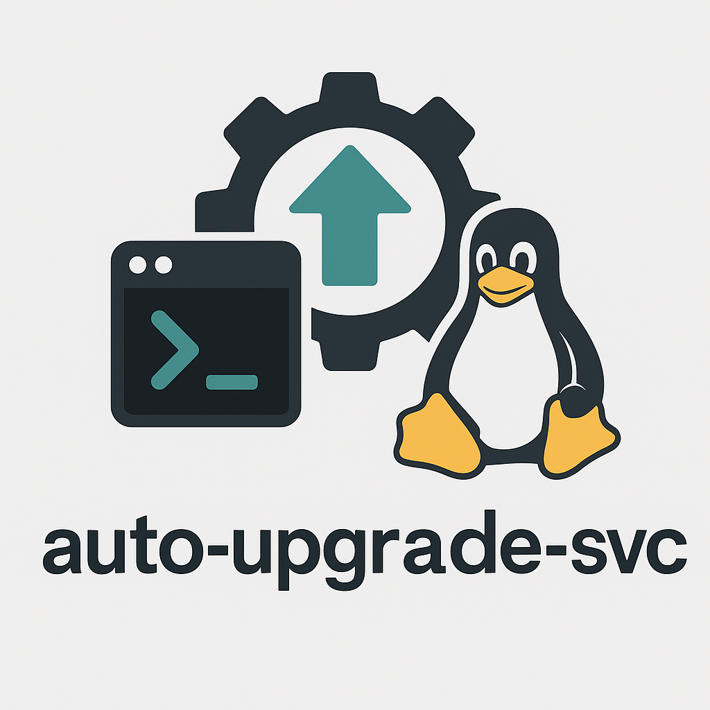

<div align="center" style="position: relative;">
  
</div>

<br>

# AUTO-UPGRADE-SVC

> *A simple, extensible system service for automatically updating and upgrading Linux packages at boot.*

<p align="center">
  <a href="https://github.com/dasunwickr/auto-upgrade-svc/blob/main/LICENSE">
    
  </a>
  
  
  
</p>

---

## Quick Links

- [Overview](#-overview)
- [Features](#-features)
- [Project Structure](#-project-structure)
  - [Project Index](#-project-index)
- [Getting Started](#-getting-started)
  - [Prerequisites](#-prerequisites)
  - [Installation](#-installation)
  - [Usage](#-usage)
  - [Testing](#-testing)
- [Project Roadmap](#-project-roadmap)
- [Contributing](#-contributing)
- [License](#-license)
- [Acknowledgments](#-acknowledgments)

---

## 📦 Overview

`auto-upgrade-svc` is a lightweight Go-based system service designed to automatically update and upgrade packages on supported Linux distributions during system boot.
Currently, Fedora is supported with plans to expand to other distros.

The project is designed with scalability and modularity in mind to support multiple Linux package managers and system init systems.

---

## ✨ Features

- Automatically detects Linux distribution and runs the appropriate package update commands.
- Supports Fedora out of the box.
- Generates and manages a systemd service unit to run updates at boot.
- Modular internal architecture to add support for other distros and init systems easily.
- Runs with sudo privileges only when needed, keeping security in mind.

---

## 🗂️ Project Structure

```sh
└── auto-upgrade-svc/
    ├── README.md
    ├── cmd
    │   └── auto-upgrade
    │       └── main.go
    ├── go.mod
    └── internal
        ├── distro
        ├── systemd
        └── updater
````

### 🔎 Project Index

<details open>
  <summary><b><code>AUTO-UPGRADE-SVC/</code></b></summary>
  <details>
    <summary><b>Root</b></summary>
    <table>
      <tr>
        <td><b><a href='https://github.com/dasunwickr/auto-upgrade-svc/blob/master/go.mod'>go.mod</a></b></td>
        <td>Defines module path and dependencies</td>
      </tr>
    </table>
  </details>
  <details>
    <summary><b>cmd/auto-upgrade</b></summary>
    <table>
      <tr>
        <td><b><a href='https://github.com/dasunwickr/auto-upgrade-svc/blob/master/cmd/auto-upgrade/main.go'>main.go</a></b></td>
        <td>Program entrypoint, initializes updater and systemd manager</td>
      </tr>
    </table>
  </details>
  <details>
    <summary><b>internal/updater</b></summary>
    <table>
      <tr>
        <td><b><a href='https://github.com/dasunwickr/auto-upgrade-svc/blob/master/internal/updater/updater.go'>updater.go</a></b></td>
        <td>Updater interface and Fedora implementation</td>
      </tr>
    </table>
  </details>
  <details>
    <summary><b>internal/systemd</b></summary>
    <table>
      <tr>
        <td><b><a href='https://github.com/dasunwickr/auto-upgrade-svc/blob/master/internal/systemd/manager.go'>manager.go</a></b></td>
        <td>Systemd service manager to create and enable units</td>
      </tr>
    </table>
  </details>
  <details>
    <summary><b>internal/distro</b></summary>
    <table>
      <tr>
        <td><b><a href='https://github.com/dasunwickr/auto-upgrade-svc/blob/master/internal/distro/distro.go'>distro.go</a></b></td>
        <td>Detects Linux distro and returns appropriate updater</td>
      </tr>
      <tr>
        <td><b><a href='https://github.com/dasunwickr/auto-upgrade-svc/blob/master/internal/distro/fedora.go'>fedora.go</a></b></td>
        <td>Fedora-specific distro detection and updater</td>
      </tr>
    </table>
  </details>
</details>

---

## 🚀 Getting Started

### 🧰 Prerequisites

* **Go** (1.20 or newer) installed.
* Linux system (Fedora recommended for now).

---

### 📥 Installation

Clone and build the project:

```sh
git clone https://github.com/dasunwickr/auto-upgrade-svc.git
cd auto-upgrade-svc
go build ./cmd/auto-upgrade
```

This produces a binary named `auto-upgrade`.

---

### ⚙️ Usage

Run the binary directly:

```sh
sudo ./auto-upgrade
```

Or run with Go:

```sh
go run ./cmd/auto-upgrade
```

The service will:

* Update metadata and upgrade packages.
* Create and enable a systemd unit on first run.

---

### 🧪 Testing

Run all tests:

```sh
go test ./...
```

---

## 🛣️ Project Roadmap

* [x] Fedora support with DNF
* [ ] Ubuntu/Debian support (APT)
* [ ] Arch Linux support (Pacman)
* [ ] Support for other init systems (SysV, OpenRC)
* [ ] Auto rollback on failure
* [ ] Logging and metrics integration

---

## 🤝 Contributing

Contributions are welcome! Please:

1. Fork the repo
2. Create a new branch
3. Make and test your changes
4. Submit a pull request

Refer to [CONTRIBUTING.md](https://github.com/dasunwickr/auto-upgrade-svc/blob/main/CONTRIBUTING.md) for more info.

---

## 🪪 License

This project is licensed under the **GNU General Public License v3 (GPLv3)**.

📄 [View full license](https://www.gnu.org/licenses/gpl-3.0.en.html)

---

## 🙏 Acknowledgments

* Inspired by the Linux ecosystem and best practices in package automation.
* Thanks to the open source community for tools and ideas.
